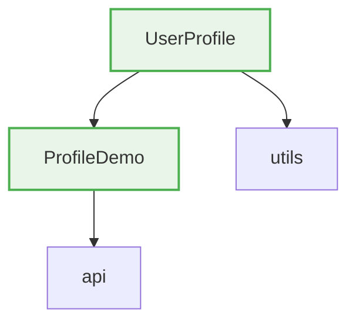

# Dependency Graph Diff Integration

## Overview
The dependency graph analysis now uses `madge` for sophisticated dependency analysis and generates Mermaid diagrams showing PR-specific dependency relationships.

## New Features

### 1. Live Dependency Analysis
- **madge Integration**: Uses `madge` library for accurate dependency analysis
- **PR-Focused**: Only analyzes files changed in the current PR
- **Visual Diagrams**: Generates Mermaid diagrams that render natively in GitHub

### 2. Enhanced Dependency Diff (`dependency-diff.js`)
- **Smart File Filtering**: Automatically filters for JavaScript/TypeScript files
- **Circular Dependency Detection**: Identifies and highlights circular dependencies
- **Fallback Mode**: Falls back to simple import analysis when madge is unavailable
- **Multi-format Support**: Supports JS, TS, JSX, TSX files

### 3. Visual Features

#### Mermaid Diagram Elements
- **Changed Files**: Green styling for files modified in the PR
- **Circular Dependencies**: Red styling for files with circular dependencies
- **Clean Node Names**: File names without extensions and special characters
- **Dependency Arrows**: Clear visual relationships between files

#### Stats Display
- Total files analyzed
- Number of dependencies mapped
- Circular dependency count
- Maximum dependency depth

### 4. Workflow Integration
- **Node.js Dependencies**: Automatically installs `madge` and `dependency-cruiser`
- **Error Handling**: Graceful fallback when dependencies aren't available
- **Live Generation**: Runs on every PR update for current dependency state

## How It Works

### 1. File Discovery
```javascript
// Get changed files from git diff
const changedFiles = execSync('git diff --name-only origin/main')
  .toString()
  .split('\n')
  .filter(f => f.endsWith('.js'));
```

### 2. Dependency Analysis
```javascript
// Generate dependency tree for changed files
const dependencies = await madge(codeFiles, {
  fileExtensions: ['js', 'jsx', 'ts', 'tsx'],
  excludeRegExp: [/node_modules/, /\.test\./, /\.spec\./],
});
```

### 3. Mermaid Generation
```javascript
// Generate Mermaid diagram focused on PR changes
let mermaidDiagram = '```mermaid\ngraph TD\n';
Object.entries(graph).forEach(([file, deps]) => {
  // Create nodes and edges for each dependency relationship
});
```

## Sample Output

### Mermaid Diagram


### Stats Summary
**Graph Stats:** 3 files analyzed, 5 dependencies mapped, max depth: 2

**Legend:** 🟢 Changed files, 🔴 Circular dependencies

## Benefits

### For Reviewers
- **Quick Visual Understanding**: See dependency relationships at a glance
- **Impact Assessment**: Understand which files are connected
- **Risk Identification**: Immediately spot circular dependencies
- **Scope Clarity**: See only PR-relevant dependencies

### For Developers
- **Dependency Validation**: Catch circular dependencies early
- **Architecture Visibility**: See how changes affect the codebase structure
- **Refactoring Guidance**: Understand impact before making changes

## Installation Requirements

### GitHub Actions Workflow
```yaml
- name: Install Node.js dependencies for dependency analysis
  run: |
    npm install -g madge
    npm install -g dependency-cruiser
```

### Fallback Behavior
- When `madge` is unavailable, uses simple import/require analysis
- Still generates Mermaid diagrams with basic relationships
- Maintains functionality across different environments

## Configuration

### File Type Support
- JavaScript (`.js`, `.mjs`, `.cjs`)
- TypeScript (`.ts`)
- React (`.jsx`, `.tsx`)
- Excludes test files and node_modules

### Analysis Scope
- Only analyzes files changed in the current PR
- Filters out irrelevant files automatically
- Focuses on meaningful code relationships

This integration provides reviewers with immediate visual context for understanding the dependency impact of PR changes, making code review more efficient and comprehensive.
