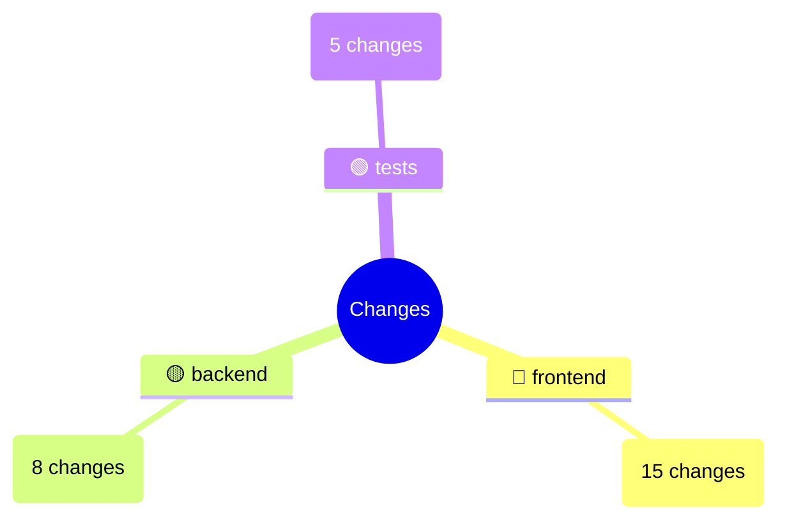
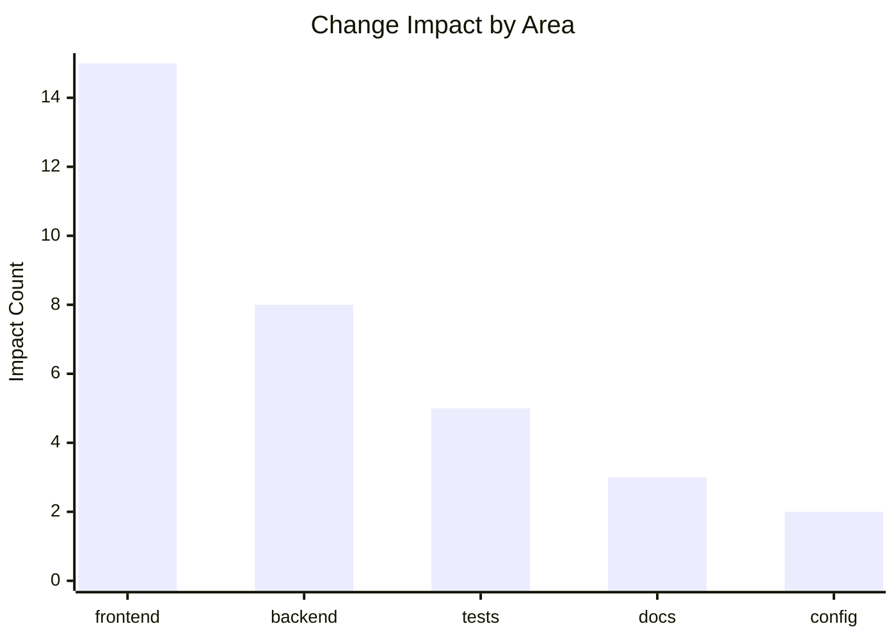

# PR Description Duplicates Fix & Mermaid Heatmaps

## Problem Fixed
The PR description was showing duplicate "Development Flow" sections and redundant impact information.

## Root Cause
- **Python Layer**: `semantic_commit_analyzer.py` was generating `visual_summary` content with "Development Flow" sections
- **JavaScript Layer**: `semantic-commit-pr-description.js` was also adding its own "Development Flow" section
- **Result**: Duplicate content appearing in PR descriptions

## Solution Implemented

### 1. Eliminated Duplicate Content Source
**Modified `semantic_commit_analyzer.py`:**
```python
def create_visual_summary(self, story: ChangeStory) -> str:
    """Generate a visual representation of the change story using actual images."""
    # Skip visual summary generation to avoid duplicates
    # Mermaid visualizations are now handled in JavaScript layer
    return ""
```

**Benefits:**
- Removes Python-generated visual content that was duplicating JavaScript content
- Centralizes all visualization generation in the JavaScript layer
- Cleaner separation of concerns

### 2. Enhanced JavaScript with Mermaid Heatmaps
**Added Mermaid Visualizations:**

#### Heatmap (Mindmap Style)


#### Bar Chart


**Color Coding:**
- 🔴 High impact (>80% of max)
- 🟠 Medium-high impact (60-80%)
- 🟡 Medium impact (40-60%)
- 🟢 Low impact (<40%)

### 3. Improved Content Structure
**New PR Description Format:**
```markdown
## Change Story

**What:** [Clear description of changes]

**Why:** [Reasoning behind changes]

**Development Flow:** Feature → Test → Docs

**Impact Heatmap:**
[Mermaid mindmap visualization]

**Impact:** frontend: 15 | backend: 8 | tests: 5
```

## Technical Implementation

### Mermaid Heatmap Generation
```javascript
function generateImpactHeatmap(impactAreas) {
  // Generate mindmap with color-coded impact levels
  const maxImpact = Math.max(...Object.values(impactAreas));
  
  entries.forEach(([area, count]) => {
    const intensity = count / maxImpact;
    let emoji = '🟢'; // Low impact
    if (intensity >= 0.8) emoji = '🔴'; // High impact
    else if (intensity >= 0.6) emoji = '🟠'; // Medium-high
    else if (intensity >= 0.4) emoji = '🟡'; // Medium
    
    chart += `    ${emoji} ${area}\n`;
    chart += `      (${count} changes)\n`;
  });
}
```

### Bar Chart Generation
```javascript
function generateMermaidBarChart(impactAreas) {
  // Generate xychart-beta with sorted impact data
  const topEntries = entries.slice(0, 5);
  chart += '```mermaid\nxychart-beta\n';
  chart += '    title "Change Impact by Area"\n';
  // ... rest of chart generation
}
```

## Benefits

### For Reviewers
- **Single Source**: No more duplicate content confusion
- **Visual Clarity**: Immediate impact understanding through colors and charts
- **GitHub Native**: Mermaid charts render directly in GitHub
- **Scannable**: Quick visual assessment of change scope

### For Developers
- **Cleaner PR Descriptions**: No redundant information
- **Better Insights**: Visual representation of impact distribution
- **Consistent Format**: Standardized PR description structure

### Technical Benefits
- **Maintainable**: Single source of truth for visualizations
- **Extensible**: Easy to add new Mermaid chart types
- **Performant**: No external dependencies for visualization
- **Reliable**: Fallback handling for missing data

## Example Output

### Before (Duplicated)
```
Development Flow: Feature → Test → Docs
Impact: frontend: 15 | backend: 8

Development Flow
Summary: Feature Development(5) → Testing(3) → Documentation(2)
Impact: frontend: 15 | backend: 8
```

### After (Clean & Visual)
```
**Development Flow:** Feature → Test → Docs

**Impact Heatmap:**
[Mermaid mindmap with color-coded areas]

**Impact:** frontend: 15 | backend: 8 | tests: 5
```

This fix ensures clean, non-duplicated PR descriptions with enhanced visual feedback through native Mermaid charts that render beautifully in GitHub!
